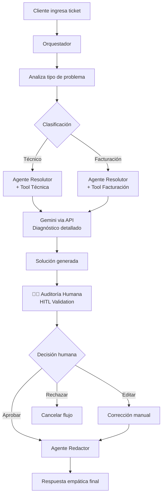

# 🤖 Google ADK Agents - Sistema de Soporte Inteligente

Sistema de soporte automatizado construido con **Google ADK** que implementa un patrón de múltiples agentes especializados para resolver tickets de clientes usando IA, con capacidad Human-in-the-Loop (HITL) para validación humana.

## 📋 Propósito de la POC (Proof of Concept)

Esta **POC** fue diseñada para demostrar las capacidades de **Google ADK** en un escenario real de soporte al cliente, mostrando cómo múltiples agentes de IA pueden trabajar coordinadamente para resolver problemas complejos con supervisión humana.

### 🎯 Objetivos de la Demostración

1. **🤖 Orquestación Inteligente**: Demostrar cómo un agente coordinador puede gestionar flujos complejos distribuyendo tareas a agentes especializados
2. **🔧 Especialización de Agentes**: Mostrar agentes con responsabilidades específicas (clasificación, resolución, redacción)
3. **🛠️ Integración de Herramientas**: Ilustrar cómo los agentes pueden invocar APIs externas (Gemini) de forma autónoma
4. **👥 Human-in-the-Loop**: Implementar validación humana manteniendo la eficiencia del sistema automatizado
5. **🌐 Interfaces Múltiples**: Proporcionar tanto CLI como interfaz web para diferentes casos de uso

## 🏗️ Arquitectura del Sistema

**Patrón:** Orquestador + Sub-agentes + Herramientas Externas + Human-in-the-Loop  
**Tecnologías:** Python 3.11+, Google ADK, FastAPI, Gemini 2.5 Flash

### 🎯 Flujo de Trabajo



### 🧠 Agentes Especializados

- **🎭 Orquestador** (`gemini-3-flash-preview`): Coordina todo el flujo y maneja comunicación entre agentes
- **🔧 Agente Resolutor** (`gemini-3-flash-preview`): Especialista en clasificación y resolución de problemas
- **✍️ Agente Redactor** (`gemini-3-flash-preview`): Convierte soluciones técnicas en respuestas empáticas al cliente

## 📂 Estructura del Proyecto

```
google-adk-agents-poc/
│
├── agents/                                    # 🤖 Agentes especializados
│   ├── __init__.py
│   ├── orquestador.py                         # Coordinador principal
│   ├── agente_resolutor.py                    # Clasificador y resolutor
│   └── agente_redactor.py                     # Redactor empático
│
├── tools/                                     # 🔧 Herramientas invocables
│   ├── __init__.py
│   ├── llamar_model.py                        # Adaptador a Gemini API
│   ├── resolver_problema_tecnico.py
│   ├── resolver_problema_facturacion.py
│   └── resolver_problema_con_multimodel.py
│
├── workflows/                                 # 📋 Flujos de trabajo
│   ├── __init__.py
│   └── flujo_soporte.py                       # Flujo principal + HITL
│
├── config/                                    # ⚙️ Configuraciones
│   ├── __init__.py
│   └── settings.py                            # Variables globales y servicios
│
├── .github/
│   └── workflows/
│       ├── ci.yml                             # Pipeline CI/CD
│       └── deploy.yml                         # Workflow de despliegue
│
├── main.py                                    # 💻 CLI interactivo
├── deploy_agent_engine.py                     # Utilidad de despliegue en Agent Engine
├── agent_engine_resource.txt                  # Descriptor de recurso Agent Engine
├── cloudbuild.yaml                            # Google Cloud Build config
├── deploy-gcp.sh                              # Script de despliegue GCP
├── setup-gcp.sh                               # Script de configuración GCP
├── requirements.txt                           # 📦 Dependencias
├── .env.example                               # 🔐 Plantilla de variables de entorno
└── README.md                                  # 📖 Este archivo
```

## 🚀 Inicio Rápido

### Configuración del Entorno

```bash
# Clonar el repositorio
git clone <repo-url>
cd google-adk-agents-poc

# Crear entorno virtual
python -m venv venv

# Activar entorno
source venv/bin/activate

# Instalar dependencias
pip install -r requirements.txt

# Activar key de google
export GOOGLE_API_KEY=xxxxxxxxxxx
```


## 🎮 Modalidades de Ejecución

### 🖥️ 1. CLI Interactivo (Por Defecto)

```bash
python main.py
```

### 🌐 2. Google ADK Web (Recomendado)

```bash
# Comando ADK directo
adk web --host 0.0.0.0 --allow_origins "*"
```


### 📝 Modificar Agentes

Los agentes están en `agents/` y usan el framework Google ADK:

```python
# Ejemplo: agents/mi_agente.py
from google.adk.agents import LlmAgent

mi_agente = LlmAgent(
    name="MiAgente",
    model="gemini-3-flash-preview",
    instruction="Tu especialidad aquí...",
    tools=[...]  # Herramientas opcionales
)
```

### 🔨 Crear Nuevas Herramientas

```python
# Ejemplo: tools/mi_herramienta.py
async def mi_herramienta(input: str) -> str:
    """
    Descripción de la herramienta.
    Los agentes pueden invocar esta función.
    """
    # Tu lógica aquí
    return "resultado"
```

No olvides agregar a `tools/__init__.py`:

```python
from .mi_herramienta import mi_herramienta
__all__ = [..., "mi_herramienta"]
```

## 📄 Licencia

MIT License - ver archivo `LICENSE` para detalles.

---

### 🎯 Casos de Uso

**✅ Ideal para:**
- Soporte técnico automatizado
- Clasificación inteligente de tickets  
- Validación humana de respuestas de IA
- Empresas que requieren trazabilidad completa

**⚠️ Consideraciones:**
- Requiere API keys de servicios de IA (costo variable)
- Latencia dependiente de servicios externos
- Recomendado para volúmenes medios (< 1000 tickets/día)

### 🔗 Enlaces Útiles

- [Google ADK Documentation](https://developers.google.com/ai/adk)
- [Gemini AI Documentation](https://developers.google.com/gemini)
- [Google AI Studio](https://aistudio.google.com/)
- [FastAPI Documentation](https://fastapi.tiangolo.com/)
- [Vertex AI Documentation](https://cloud.google.com/vertex-ai/docs)

---

**Hecho con ❤️ por SoftwareOne usando Google ADK y Python**